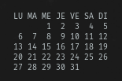
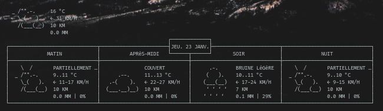

# Conky
## Conky Widget

In this new version, all elements have been adjusted for Manjaro Linux XFCE x64 with Lenovo laptop. Match for 1366x768 screen resolution.

## Motivation
The main reason for this repository is to save in one place and thus be able to share some work on the awesome personalization tool named **conky**

I really liked the design work provided by gvoze32 with the Mainte theme (See [here](https://github.com/gvoze32/Mainte)). And I wanted to take this style and apply it to other widgets on my desktop.

## Screenshots


## Features
Actually the gadgets can do :

- Show and Monitor computer metric like fan speed, processor use etc... (
- Show local weather
- Show a little calendar

## Installation

For those who want to try this conky's themes, here’s a step by step how to setup guide:

**1.** First of all, open terminal and install conky if you don’t have it via command:

```bash
sudo pacman -S conky
```

you may want to install this optionnal package :
 - calendar (required by conkyrc-calendar)

**2.** Clone this repository
```bash
git clone https://github.com/Kosteron/Conky.git
```

**3.** Copy all folder to `~/.conky` (set hidden file to visible on your file manager cause the folder is hidden) or create this folder if it doesnt exist :
```bash
mkdir ~/.conky
mv Conky-master/* ~/.conky
```

**4.** Open terminal and type
```bash
cd ~/.conky/
./conky-launch.sh
```

**5.** Move the font to your local font folder :
```bash
sudo mv ~/.conky/fonts/*
``` 

**6.** You may have to change some parameters like resolution or position to match your actual linux desktop characteristics.
So edit **conky-rc** file and change this kind of parameter for the position on your screen : 
```
conky.config = {
...
gap_x = 10,
gap_y = 520,
...
};
```

To automatically run when startup, just add conky-launch.sh to autostart.

## Credits
Many thanks to :

- [Vector](https://www.reddit.com/r/thinkpad/search/?q=exploded%20wallpaper&restrict_sr=1)
- **gvoze32**, which inspired me, and from which I took the graphic design for the other conky's widgets
	- [Reddit Thread](https://www.reddit.com/r/unixporn/comments/e49pgl/oc_mainte_a_simple_and_functional_conky_theme/)
	- [Github repository](https://github.com/gvoze32/Mainte)

## License
MIT © [Kosteron]()

## Screenshot



