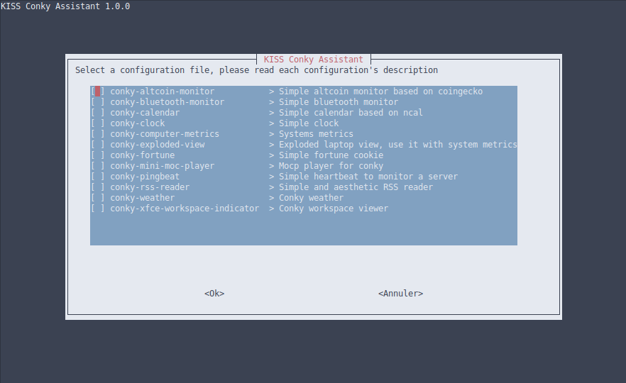

# Conky


Conky is a free, light-weight system monitor for X, that displays any kind of information on your desktop.

You can find more information about conky :point_right: [here](https://github.com/brndnmtthws/conky)

## Motivation
The main reason for this repository is to save in one place and thus be able to share some work on the awesome personalization tool named **conky**

I really liked the design work provided by gvoze32 with the Mainte theme (See [here](https://github.com/gvoze32/Mainte)). And I wanted to take this style and apply it to other widgets on my desktop.

## Screenshots


## Features
Actually the gadgets can do :

- Show and Monitor computer metric like fan speed, processor use etc... (Use the awesome conky theme Mainte)
- Show local weather (Use the awesome http://wttr.in/ to show the local weather)
- Show a little calendar
- And much more !

## Installation

For those who want to try this conky's themes, here’s a step by step how to setup guide:

**1.** First of all, open terminal and install conky if you don’t have it via command:

```bash
sudo pacman -S conky
```

you may want to install optionnal package, please refer to the table below

**2.** Clone this repository
```bash
git clone https://github.com/Kosteron/Conky.git
```

**3.** Copy all folder to `~/.conky` (set hidden file to visible on your file manager cause the folder is hidden) or create this folder if it doesnt exist :
```bash
mkdir ~/.conky
mv Conky-master/* ~/.conky
```

**4.** Open terminal and type
```bash
cd ~/.conky/
./conky-launch.sh
```

**5.** Move the font to your font folder :
```bash
sudo mv ~/.conky/fonts/* /usr/share/fonts
```

**6.** You may have to change some parameters like resolution or position to match your actual linux desktop characteristics.
So edit **conky-rc** file and change this kind of parameter for the position on your screen :
```
conky.config = {
...
gap_x = 10,
gap_y = 520,
...
};
```

## Usage



This relatively simple tool, takes care of part of your work, it allows you to generate a launch script automatically for conky from the configuration files present in the folder **conf**.

```
bash conky-configure.sh
```

If you want to add a conky widget managed by this tool, you must create a folder and its associated configuration file with the same name.
Actually this tool don't support complex conky widget who need multiple bash/python script to operate.

To add a description for your conky widget add a comment on the top of your conky config :
```
-- My description

conky.config = {
    background = false,
    font = 'Fantasque Sans Mono:size=10',
	...
```

If you don't want to manage your **conky-launch.sh** with this tool, instead edit it manually ;)

Edit the **conky-launch.sh** and uncomment or comment the lines corresponding to the widgets you don't want

To automatically run when startup, just add conky-launch.sh to autostart.

## Full detail

Check the following tweak column to see how to modify the widgets to suit your needs.

| Name | Dependencies | Description | Tweak |
|----|----|----|----|
| **conky-calendar** | ncal | Simple Calendar | :heavy_multiplication_x: |
| **conky-clock** | :heavy_multiplication_x: | Simple clock | :heavy_multiplication_x: |
| **conky-exploded-view** | acpi | Show computer metrics | :heavy_multiplication_x: |
| **conky-computer-metrics** | acpi | Show computer metrics | :heavy_multiplication_x: |
| **conky-fortune** | fortune-mod | Displays fortune cookie on the desktop | :heavy_multiplication_x: |
| **conky-mini-moc-player** | mocp, ffmpeg | Display information about the current song listened with mocp | :heavy_multiplication_x: |
| **conky-pingbeat** | :heavy_multiplication_x: | Simple pingbeat | [doc](docs/conkyrc-pingbeat.md) |
| **conky-weather** | :heavy_multiplication_x: | Display a lot of information about weather | [doc](docs/conkyrc-weather.md) |
| **conky-xfce-workspace-indicator** | :heavy_multiplication_x: | Simple workspace indicator | :heavy_multiplication_x: |
| **conky-altcoin-monitor** | jq & awk | Simple altcoin price indicator | [doc](docs/conkyrc-altcoin-monitor.md) |
| **conky-rss-reader** | conky-all | Simple RSS Reader | [doc](docs/conky-rss-reader.md) |
| **conky-bluetooth-monitor** | bluetoothctl | Simple Bluetooth Monitor | [doc](docs/conky-bluetooth-monitor.md) |

## Credits
Many thanks to :

- [Vector](https://www.reddit.com/r/thinkpad/search/?q=exploded%20wallpaper&restrict_sr=1)
- **gvoze32**, who inspired me, and where I took the graphic design for the other conky's widgets
	- [Reddit Thread](https://www.reddit.com/r/unixporn/comments/e49pgl/oc_mainte_a_simple_and_functional_conky_theme/)
	- [Github repository](https://github.com/gvoze32/Mainte)
- **Igor chubin**
	- [Github repository](https://github.com/chubin/wttr.in)

## License
MIT © [Kosteron]()