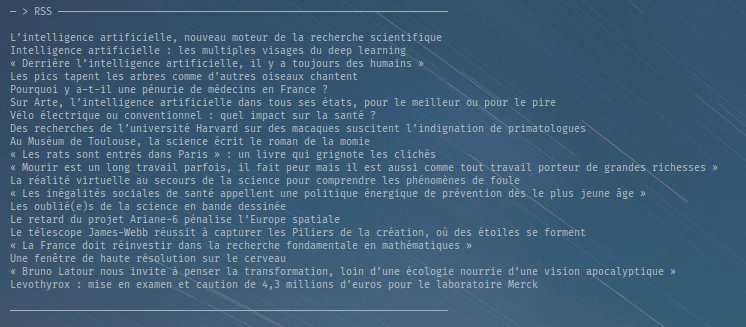

# conky-rss-reader



If you want to change the displayed rss feed, In the file **conky-rss-reader** change this key :
```bash
${rss https://www.lemonde.fr/sciences/rss_full.xml 1 item_titles 4}
```
More information about this key [here](https://conky.cc/variables#rss)