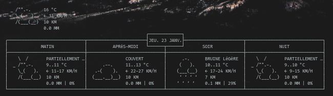

# conkyrc-weather




If you want to change the location of the local weather, please edit the bash script **weather-pull.sh** and change the following line :
```bash
curl "http://wttr.in/aix-en-provence?T&1&Q&F&lang=fr" --silent --max-time 3 > /tmp/weather.tmp
```
by what you want, for example London : 
```bash
curl "http://wttr.in/london?T&1&Q&F" --silent --max-time 3 > /tmp/weather.tmp
```
You can find more parameter and option on the wttr.in [Github repository](https://github.com/chubin/wttr.in).